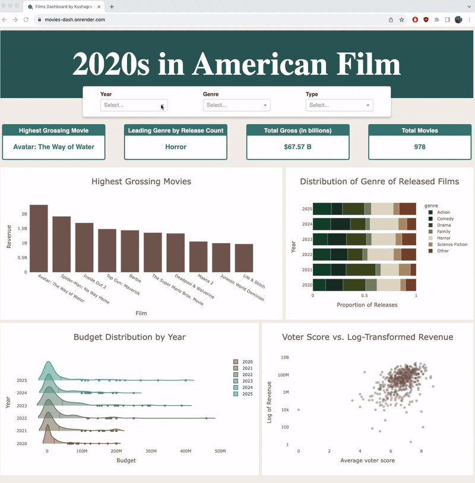

# Movie Analytics Dashboard

An interactive analytics dashboard built with Dash and Plotly to explore American movie data from 2020s. This dashboard provides comprehensive insights into movie trends and performance through interactive visualizations and key performance indicators.



## Project Overview

This dashboard analyzes movie data from this decade for movies produced in the United States, offering users the ability to explore various aspects of the film industry including box office performance, genre trends, release patterns, and audience ratings. The application features a clean, modern interface with responsive design and interactive elements.

Visit the live dashboard [here](movies-dash.onrender.com)

## Notes of Data Management

### Dataset Overview
The dashboard contains 978 carefully curated movies from this decade. While this represents a subset of all movies released during this period, the dataset has been filtered to ensure data quality and completeness. Movies with missing critical information (genre, budget, release dates, etc.) were excluded to maintain visualization accuracy. See the SQL filtering code below for the complete data cleaning process:
```
SELECT * FROM movie_data_raw
    WHERE name IS NOT NULL
        AND genre IS NOT NULL
        AND genre <> 'Documentary'
        AND release_year IS NOT NULL
        AND TRIM(release_year) <> ''
        AND TRIM(genre) <> ''
        AND budget > 1000
        AND vote_average < 10
        AND production_country_final = 'United States of America'
```

### Genre Classification Methodology
Movies in TMDB are often assigned multiple genres as movies often blend various genre elements, but genre visualizations and filtering require a single primary genre per film for simplicity. To handle this:
- The first listed genre in TMDB is used as the primary classification
- When "Animation" is the first genre, the second genre is selected instead, as animation is captured in a separate "Type" column
- This approach may not capture every film's precise genre (e.g., "Beetlejuice Beetlejuice" is classified as Horror despite its substantial comedic content), but ensures consistent categorization across the dataset without sacrificing accuracy

### Production Country Validation
To ensure that only movies produced in the US are used in the dashboard, production country data undergoes cross-validation so that only films listing "United States" as a production country in both TMDB and Wikipedia are included in the dataset. See the SQL code that creates the `production_country_final` column in the database table:
```
UPDATE movie_data_raw 
SET production_country_final = 
    CASE 
        WHEN production_country = production_country2 THEN production_country
        ELSE 'other'
    END
```

### Revenue Data Transformation
The scatter plot uses logarithmic scaling on the y-axis for revenue data. This transformation is essential for the following reasons:
- Wide value range: Movie revenues span from thousands to billions of dollars (6+ orders of magnitude)
- Relationship clarity: Log scaling reveals correlations between budget and revenue across all budget ranges, not just blockbusters

## Dashboard Features

### Key Performance Indicators (KPIs)
- Highest Grossing Movie
- Leading Genre
- Total Cumulative Revenue
- Total Movies

### Interactive Charts
- Top 10 Grossers
- Genre Distribution of Releases
- Budget Distribution by Year
- Comparison of revenue with audience ratings

### Filtering
- Year
- Genre
- Movie Type

## Technical Stack

- **Frontend:** Dash, CSS
- **Backend:** Python
- **Database:** SQLite3
- **Data Processing:** Pandas, Plotly
- **APIs:** TMDB API, Wikipedia API
- **Deployment:** Render

## Resources

1. [Real Python Dash Tutorial](https://realpython.com/python-dash/): Very helpful manual on building simple dashboards using Dash and Plotly
2. [Plotly Express Documentation](https://plotly.com/python/plotly-express/): Good reference on creating different charts using the Plotly Express API
3. Chapter 17 of *Python Crash Course* by Eric Matthes (3rd ed.): Useful tutorial on working with web APIs to extract data and using Plotly to visualize them
4. Chapter 7 of *Automate the Boring Stuff with Python* by Al Sweigart (2nd ed.): Informative guide on applying regular expressions to accurately extract specific string patterns from text data